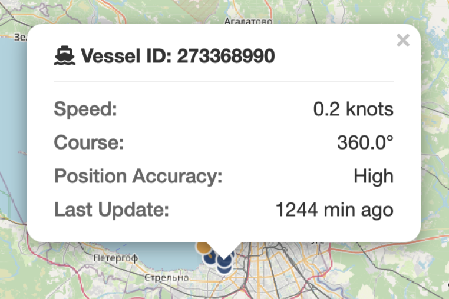
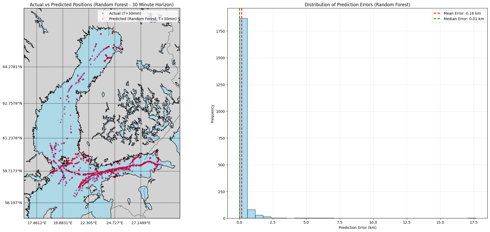

# NAVICAST: Real-Time Vessel Tracking and Prediction System

[](https://www.python.org/)
[](https://fastapi.tiangolo.com/)
[](https://xgboost.readthedocs.io/)
[](https://www.postgresql.org/)

<p align="center">
  
</p>

<p align="center">
  
</p>

## Table of Contents
- [Overview](#overview)
- [Features](#features)
- [Tech Stack](#tech-stack)
- [Installation](#installation)
- [Project Structure](#project-structure)
- [How It Works](#how-it-works)
- [Performance Metrics](#performance-metrics)
- [Future Improvements](#future-improvements)
- [Acknowledgments](#acknowledgments)
- [Contact](#contact)

## Overview
NAVICAST is an innovative, real-time vessel tracking and prediction system focused on the Baltic Sea region. Leveraging Automatic Identification System (AIS) data streamed from Digitraffic, NAVICAST visualizes the current positions of 913 vessels (as of March 10, 2025) and employs a state-of-the-art machine learning model to predict their future positions. Built with a passion for machine learning and data engineering, this project combines robust data pipelines, advanced ML techniques, and an interactive, smooth graphical interface.

## Features
- **Real-Time Tracking**: Monitors and displays the current positions of vessels in the Baltic Sea using AIS data.
- **Predictive Analytics**: Utilizes a tuned XGBoost model to forecast vessel positions 30 minutes ahead, with impressive metrics:
  - Overall MSE: 1.433
  - Lat MSE: 0.3941
  - Lon MSE: 2.4719
  - MAE: 0.4381
  - R²: 0.7621
- **Interactive Visualization**: A sleek, responsive web interface built with Leaflet.js, featuring:
  - Current and predicted vessel positions (distinguished by blue and orange markers)
  - Predicted paths with dashed lines
  - Auto-refresh every 10 seconds for up-to-date data
  - Toggleable prediction display and map centering on the Baltic Sea
- **Data Pipeline**: Integrates MQTT streaming, PostgreSQL storage, and batch processing for efficient data handling.
- **ML Optimization**: Employs Optuna for hyperparameter tuning of the XGBoost model, ensuring optimal performance.

<p align="center">
  
  <br><em>Visual representation of the tracking key features presented in the UI</em>
</p>

## Tech Stack
- **Frontend**: HTML, CSS, Leaflet.js
- **Backend**: FastAPI, Python
- **Database**: PostgreSQL
- **Machine Learning**: XGBoost, Optuna, Scikit-learn
- **Data Streaming**: Paho MQTT, Digitraffic AIS feed
- **Additional Libraries**: Pandas, GeoPandas, Matplotlib, NumPy

## Installation

### 1. Clone the Repository
```bash
git clone https://github.com/imaddde867/Maritime-Vessel-Tracking-System.git
cd navicast
```

### 2. Set Up Environment
```bash
# Install Python 3.9+ and create a virtual environment
python -m venv venv
source venv/bin/activate  # On Windows: venv\Scripts\activate

# Install dependencies
pip install -r requirements.txt
```

### 3. Configure Database
- Set up a PostgreSQL database with the appropriate credentials.
- Create the database and tables:
```bash
psql -U your_username -d postgres -f schema.sql
```

### 4. Run the Application
```bash
# Start the MQTT client
python3 mqtt_client.py

# Start the prediction service
python3 prediction_service.py

# Start the MQTT streaming service
python ais_streaming.py
```

### 5. Access the Application
Open [http://localhost:8000](http://localhost:8000) in your browser to view the interface.

## Project Structure
```
navicast/
├── static/              # Frontend files (HTML, CSS, JS)
│   ├── accuracy.png     # Prediction visualization
│   ├── features.png     # Features used in ML model
├── api_server.py        # FastAPI backend
├── ais_streaming.py     # MQTT data streaming
├── prediction_service.py # ML prediction generation
├── vessel_prediction_model.pkl # Trained XGBoost model
├── requirements.txt     # Python dependencies
├── README.md            # This file
└── schema.sql           # Database schema
```

## How It Works
1. **Data Ingestion**: AIS data is streamed in real-time from Digitraffic via MQTT, processed in batches, and stored in PostgreSQL.
2. **Prediction Generation**: A tuned XGBoost model predicts vessel positions based on features like speed, course, and time differences, with results stored in the predictions table.
3. **Visualization**: The frontend fetches data via the FastAPI endpoint `/vessels`, rendering it on an interactive map with current and predicted positions.

## Performance Metrics

| Model             | Overall MSE | Lat MSE | Lon MSE | MAE   | R²    |
|-------------------|-------------|---------|---------|-------|-------|
| Linear Regression | 1.4630      | 0.4469  | 2.4791  | 0.4539| 0.7449|
| Polynomial Reg.   | 1.4488      | 0.4310  | 2.4666  | 0.4472| 0.7497|
| Random Forest     | 1.8168      | 0.5227  | 3.1109  | 0.5486| 0.6898|
| XGBoost           | 1.4958      | 0.4444  | 2.5473  | 0.4505| 0.7417|
| **XGBoost (Tuned)** | **1.433** | **0.3941** | **2.4719** | **0.4381** | **0.7621** |

<p align="center">
  
  <br><em>Comparison of predicted vs. actual vessel positions</em>
</p>

## Future Improvements
- Integrate more advanced ML models (e.g., LSTM for time-series data).
- Enhance the UI with vessel details and historical tracks.
- Deploy on a cloud service for global accessibility.

## Acknowledgments
- Digitraffic for providing real-time AIS data.
- The open-source community for tools like Leaflet.js, XGBoost, and PostgreSQL.

## Contact
Created by Imad Eddine

- Email: imadeddine200507@gmail.com
- LinkedIn: www.linkedin.com/in/imad-eddine-el-mouss-986741262
