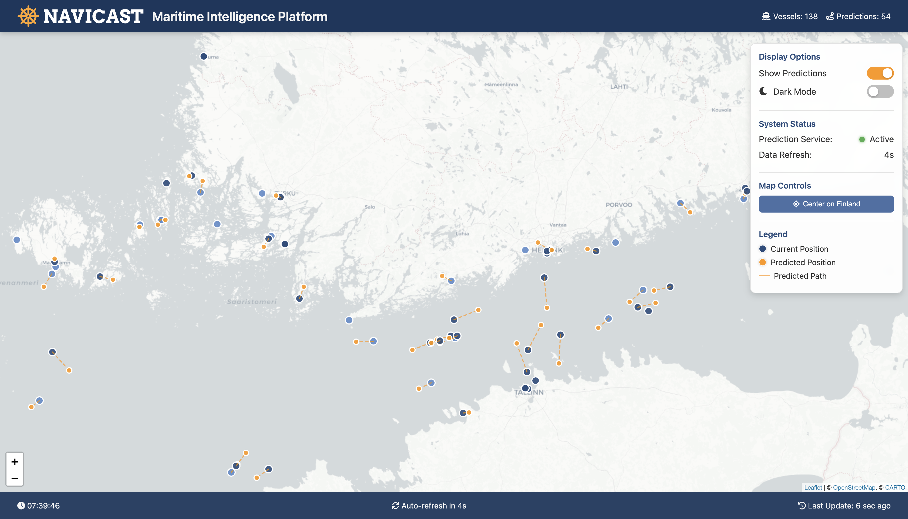
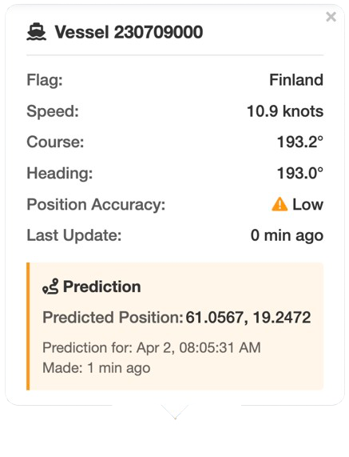

# NAVICAST - Maritime Traffic Intelligence Platform

NAVICAST is a comprehensive system for collecting, processing, and visualizing maritime vessel traffic data from AIS (Automatic Identification System) feeds. The platform provides real-time vessel tracking, trajectory prediction, and data querying capabilities.


## System Overview

NAVICAST consists of four main components:

1. **AIS Data Collection**: MQTT client that connects to the Digitraffic AIS feed and stores received vessel messages in a PostgreSQL database.
2. **Vessel Prediction**: ML-based service that predicts vessel trajectories 30 minutes ahead based on current position, heading, and speed.
3. **API Server**: REST API that provides access to vessel data and predictions with filtering capabilities.
4. **Web-based Visualization**: Interactive map interface for visualizing vessels and their predicted paths.

## Machine Learning Model

NAVICAST uses a state-of-the-art machine learning model to predict vessel positions 30 minutes into the future (upgraded from the previous 5-minute prediction window). This provides maritime traffic controllers, port authorities, and vessel operators with enhanced situational awareness and planning capabilities.

### Model Performance

The model was evaluated on its ability to predict vessel positions 30 minutes ahead:

| Model                  | Overall MSE (deg²) | Lat MSE (deg²) | Lon MSE (deg²) | MAE (deg) | R² | Mean Dist (km) | Median Dist (km) |
|------------------------|-------------------:|---------------:|---------------:|----------:|---:|---------------:|-----------------:|
| Linear Regression      | 0.0022             | 0.0007         | 0.0037         | 0.0312    | 0.9996 | 3.4280        | 2.8059           |
| Polynomial Regression  | 0.0011             | 0.0005         | 0.0017         | 0.0154    | 0.9998 | 1.8130        | 1.1577           |
| Random Forest          | 0.0000             | 0.0000         | 0.0000         | 0.0013    | 1.0000 | 0.1544        | 0.0106           |
| XGBoost                | 0.0002             | 0.0001         | 0.0003         | 0.0073    | 1.0000 | 0.8525        | 0.5726           |

**Random Forest** achieved the best performance with a mean distance error of only 154 meters and a median error of just 11 meters for 30-minute predictions.

### Prediction Visualization

<!-- Map Visualization Placeholder -->


<!-- Prediction Accuracy Plot Placeholder -->


### Vessel Tracking Details

The platform provides detailed information for each tracked vessel, including speed, course, heading, and prediction data.

<p align="center">
  
</p>

## System Architecture


### Data Flow

1. AIS messages are received via MQTT from the Digitraffic Marine API
2. Messages are processed and stored in the PostgreSQL database
3. The prediction service periodically retrieves recent vessel data and calculates 30-minute trajectory predictions
4. Predictions are stored in the database for efficient retrieval
5. The API server provides endpoints for querying vessel data and predictions
6. The web frontend displays vessels and predictions on an interactive map

## Data Management Plan

### Data Collection

- **Source**: Finnish Transport Agency's Digitraffic Marine API (AIS data feed)
- **Method**: MQTT subscription to AIS topic
- **Frequency**: Real-time message processing
- **Volume**: Approximately 5-20 MB per hour depending on vessel traffic

### Data Storage

- **Database**: PostgreSQL 13+
- **Schema**:
  - `raw_ais_data`: Stores raw AIS messages with vessel position and metadata
  - `predictions`: Stores calculated vessel trajectory predictions
- **Retention Policy**: Raw data is retained for 30 days by default
- **Backup Strategy**: Daily database backups recommended

### Data Processing

- **Validation**: AIS messages are validated for required fields before storage
- **Enrichment**: Vessel data is enriched with:
  - Country information derived from MMSI
  - Vessel type classification based on AIS type codes
  - Human-readable navigation status
- **Prediction**: Machine learning model processes vessel data to predict positions 30 minutes ahead

### Data Access

- **API**: RESTful API for querying vessel data with the following capabilities:
  - Filtering by vessel MMSI
  - Filtering by time range
  - Downloading data in JSON or CSV format
- **Visualization**: Web-based interactive map for vessel movement tracking
- **Authentication**: None in the current version (intended for private deployment)

### Software Dependencies

- **PostgreSQL**: 13.0+
- **Python**: 3.9+
- **Node.js**: 16.0+ (for development only)
- **Libraries**:
  - FastAPI
  - Uvicorn
  - Paho-MQTT
  - Psycopg2
  - Pandas
  - Scikit-learn
  - Leaflet.js (frontend)

## Deployment Instructions

### 1. Database Setup

First, install and configure PostgreSQL:

```bash
# Install PostgreSQL (Ubuntu/Debian)
sudo apt update
sudo apt install postgresql postgresql-contrib

# Create the database
sudo -u postgres psql -c "CREATE DATABASE ais_project;"
sudo -u postgres psql -c "CREATE USER navicast WITH PASSWORD 'your_password';"
sudo -u postgres psql -c "GRANT ALL PRIVILEGES ON DATABASE ais_project TO navicast;"

# Initialize database schema
sudo -u postgres psql -d ais_project -f schema.sql
```

### 2. Configure Environment

Clone the repository and install dependencies:

```bash
# Clone the repository
git clone https://github.com/imaddde867/NaviCast.git
cd NaviCast

# Install Python dependencies
pip install -r requirements.txt

# Create logs directory
mkdir -p logs
```

Update database connection parameters in each service file:
- `api_server.py`
- `mqtt_client.py`
- `prediction_service.py`

```python
# Example database configuration
DB_CONFIG = {
    "dbname": "ais_project",
    "user": "navicast",  # Replace with your database user
    "password": "your_password",  # Replace with your password
    "host": "localhost"
}
```

### 3. Start the Services

#### Option 1: Using the Startup Script

You can use the included startup script to start all services:

```bash
# Make the script executable
chmod +x start_navicast.sh

# Run the script
./start_navicast.sh
```

#### Option 2: Start Each Service Manually

Start each service in a separate terminal:

```bash
# Terminal 1: Start the MQTT client
python mqtt_client.py

# Terminal 2: Start the prediction service
python prediction_service.py

# Terminal 3: Start the API server
python api_server.py
```

### 4. Access the Application

Once all services are running:

1. Open a web browser and navigate to: http://localhost:8000
2. The main dashboard will show vessels and predictions in the Baltic Sea
3. The API endpoints are available at:
   - `http://localhost:8000/vessels` - List all vessels
   - `http://localhost:8000/vessels/{vessel_id}` - Get details for a specific vessel

## Cloud Deployment

### Deploying on Render.com (Free Tier)

NAVICAST can be deployed to the cloud using Render.com's free tier:

### 1. Create a Render.com Account
1. Go to [Render.com](https://render.com/) and sign up for a free account
2. Verify your email address and log in

### 2. Create a PostgreSQL Database
1. In your Render dashboard, click on the "New +" button
2. Select "PostgreSQL" from the dropdown menu
3. Fill in the database details:
   - Name: `navicast-db`
   - Database: `ais_project`
   - User: Leave as auto-generated
   - Region: Select the region closest to your users
   - PostgreSQL Version: 13 or higher
   - Instance Type: Free tier
4. Click "Create Database"
5. Once created, note down the database connection details

### 3. Create the Web Service
1. Click on "New +" again and select "Web Service"
2. Connect your GitHub repository
3. Configure the web service:
   - Name: `navicast-web`
   - Environment: Python
   - Build Command: `pip install -r requirements.txt`
   - Start Command: `python api_server.py`
   - Instance Type: Free
4. Add the environment variable:
   - `DATABASE_URL`: Internal Connection String from your database
5. Click "Create Web Service"

### 4. Create Worker Services
Create two background worker services following the same steps as above:

1. MQTT Client Worker:
   - Start Command: `python mqtt_client.py`
   
2. Prediction Service Worker:
   - Start Command: `python prediction_service.py`

### 5. Access Your Application
Your application will be available at the URL provided by Render (e.g., https://navicast-web.onrender.com)

## API Documentation

The NAVICAST API provides the following endpoints:

### GET /vessels
Lists all vessels with their current positions and predictions.

Query parameters:
- `mmsi`: Filter by vessel MMSI
- `from_time`: Filter by time range (start)
- `to_time`: Filter by time range (end)
- `limit`: Maximum number of vessels to return (default: 100)

### GET /vessels/{vessel_id}
Get detailed information about a specific vessel.

### GET /health
API health check endpoint.

## License

This project is licensed under the MIT License - see the LICENSE file for details.

## Acknowledgments

- Finnish Transport Agency for providing the AIS data