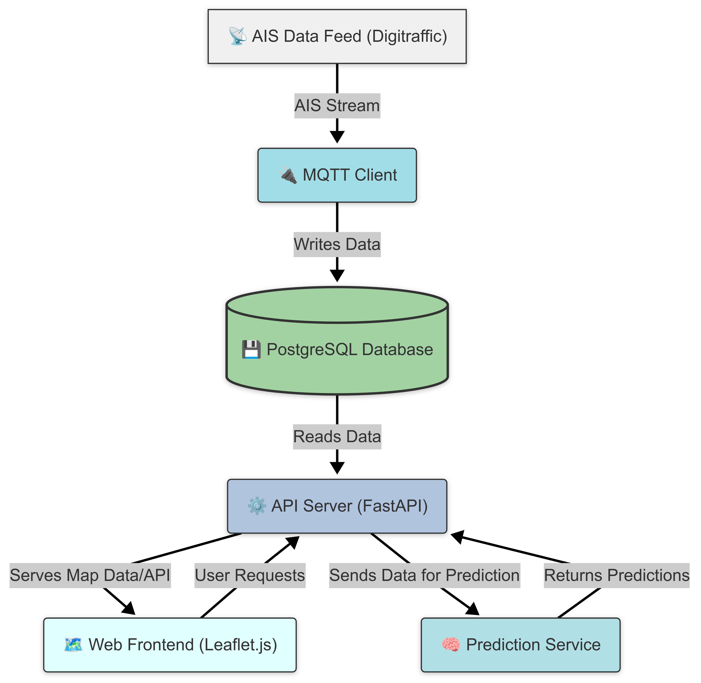

# NAVICAST - Maritime Traffic Intelligence Platform

NAVICAST is a comprehensive system for collecting, processing, and visualizing maritime vessel traffic data from AIS (Automatic Identification System) feeds. The platform provides real-time vessel tracking, trajectory prediction, and data querying capabilities.

## System Overview

NAVICAST consists of four main components:

1. **AIS Data Collection**: MQTT client that connects to the Digitraffic AIS feed and stores received vessel messages in a PostgreSQL database.
2. **Vessel Prediction**: ML-based service that predicts vessel trajectories 30 minutes ahead based on current position, heading, and speed.
3. **API Server**: REST API that provides access to vessel data and predictions with filtering capabilities.
4. **Web-based Visualization**: Interactive map interface for visualizing vessels and their predicted paths.

## Machine Learning Model

NAVICAST uses a state-of-the-art machine learning model to predict vessel positions 30 minutes into the future (upgraded from the previous 5-minute prediction window). This provides maritime traffic controllers, port authorities, and vessel operators with enhanced situational awareness and planning capabilities.

### Model Performance

The model was evaluated on its ability to predict vessel positions 30 minutes ahead:

| Model                  | Overall MSE (deg²) | Lat MSE (deg²) | Lon MSE (deg²) | MAE (deg) | R² | Mean Dist (km) | Median Dist (km) |
|------------------------|-------------------:|---------------:|---------------:|----------:|---:|---------------:|-----------------:|
| Linear Regression      | 0.0022             | 0.0007         | 0.0037         | 0.0312    | 0.9996 | 3.4280        | 2.8059           |
| Polynomial Regression  | 0.0011             | 0.0005         | 0.0017         | 0.0154    | 0.9998 | 1.8130        | 1.1577           |
| Random Forest          | 0.0000             | 0.0000         | 0.0000         | 0.0013    | 1.0000 | 0.1544        | 0.0106           |
| XGBoost                | 0.0002             | 0.0001         | 0.0003         | 0.0073    | 1.0000 | 0.8525        | 0.5726           |

**Random Forest** achieved the best performance with a mean distance error of only 154 meters and a median error of just 11 meters for 30-minute predictions.

### Prediction Visualization

<!-- Map Visualization Placeholder -->

<!-- Prediction Accuracy Plot Placeholder -->

### Vessel Tracking Details

The platform provides detailed information for each tracked vessel, including speed, course, heading, and prediction data.

  

## System Architecture

### Data Flow

1. AIS messages are received via MQTT from the Digitraffic Marine API
2. Messages are processed and stored in the PostgreSQL database
3. The prediction service periodically retrieves recent vessel data and calculates 30-minute trajectory predictions
4. Predictions are stored in the database for efficient retrieval
5. The API server provides endpoints for querying vessel data and predictions
6. The web frontend displays vessels and predictions on an interactive map

## Data Management Plan

### Data Collection

- **Source**: Finnish Transport Agency's Digitraffic Marine API (AIS data feed)
- **Method**: MQTT subscription to AIS topic
- **Frequency**: Real-time message processing
- **Volume**: Approximately 5-20 MB per hour depending on vessel traffic

### Data Storage

- **Database**: PostgreSQL 13+
- **Schema**:
  - `raw_ais_data`: Stores raw AIS messages with vessel position and metadata
  - `predictions`: Stores calculated vessel trajectory predictions
- **Retention Policy**: Raw data is retained for 30 days by default
- **Backup Strategy**: Daily database backups recommended

### Data Processing

- **Validation**: AIS messages are validated for required fields before storage
- **Enrichment**: Vessel data is enriched with:
  - Country information derived from MMSI
  - Vessel type classification based on AIS type codes
  - Human-readable navigation status
- **Prediction**: Machine learning model processes vessel data to predict positions 30 minutes ahead

### Data Access

- **API**: RESTful API for querying vessel data with the following capabilities:
  - Filtering by vessel MMSI
  - Filtering by time range
  - Downloading data in JSON or CSV format
- **Visualization**: Web-based interactive map for vessel movement tracking
- **Authentication**: None in the current version (intended for private deployment)

## Technical Requirements

### System Requirements

- **Operating System**: Linux, macOS, or Windows
- **CPU**: Dual-core 2.0+ GHz
- **RAM**: 4GB minimum, 8GB recommended
- **Storage**: 20GB minimum for database

### Software Dependencies

- **PostgreSQL**: 13.0+
- **Python**: 3.9+
- **Node.js**: 16.0+ (for development only)
- **Libraries**:
  - FastAPI
  - Uvicorn
  - Paho-MQTT
  - Psycopg2
  - Pandas
  - Scikit-learn
  - Leaflet.js (frontend)

## Deployment Instructions

### 1. Database Setup

First, install and configure PostgreSQL:
