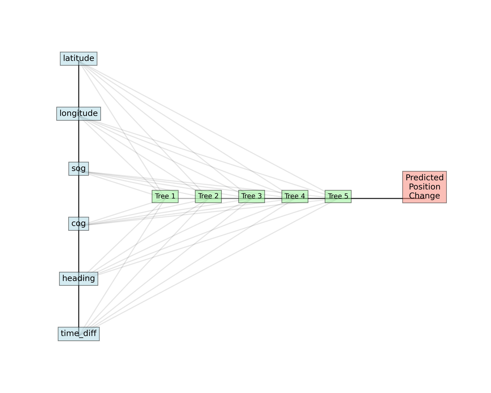
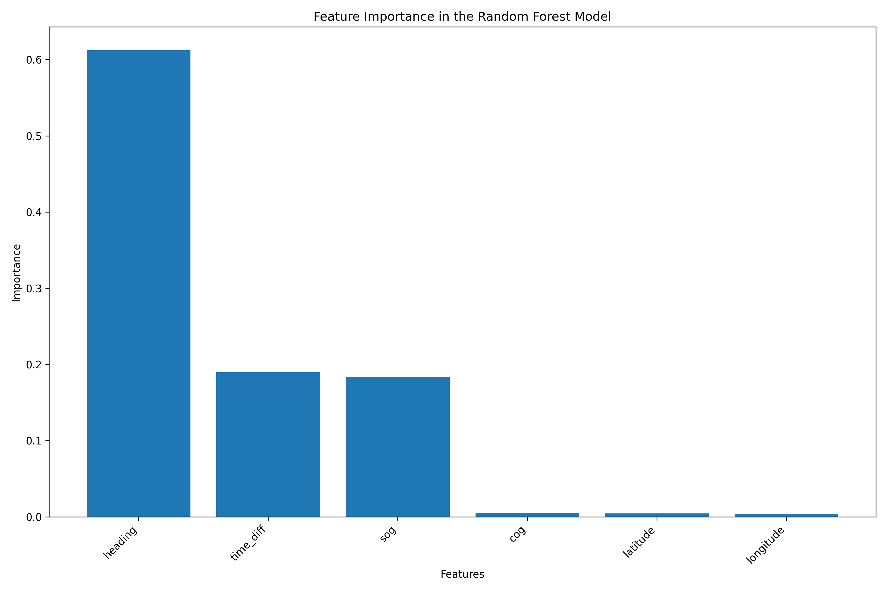
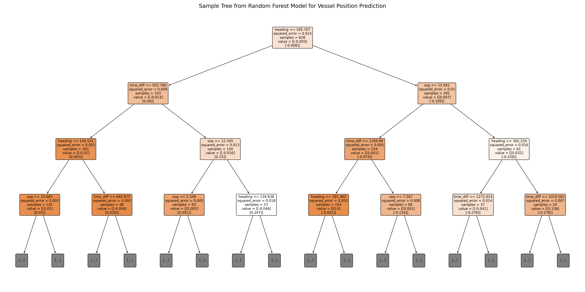
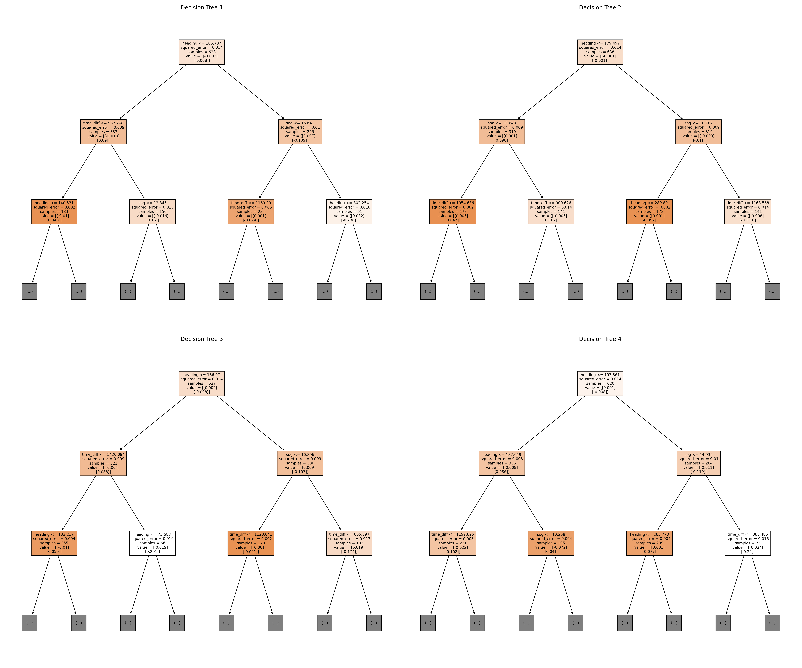
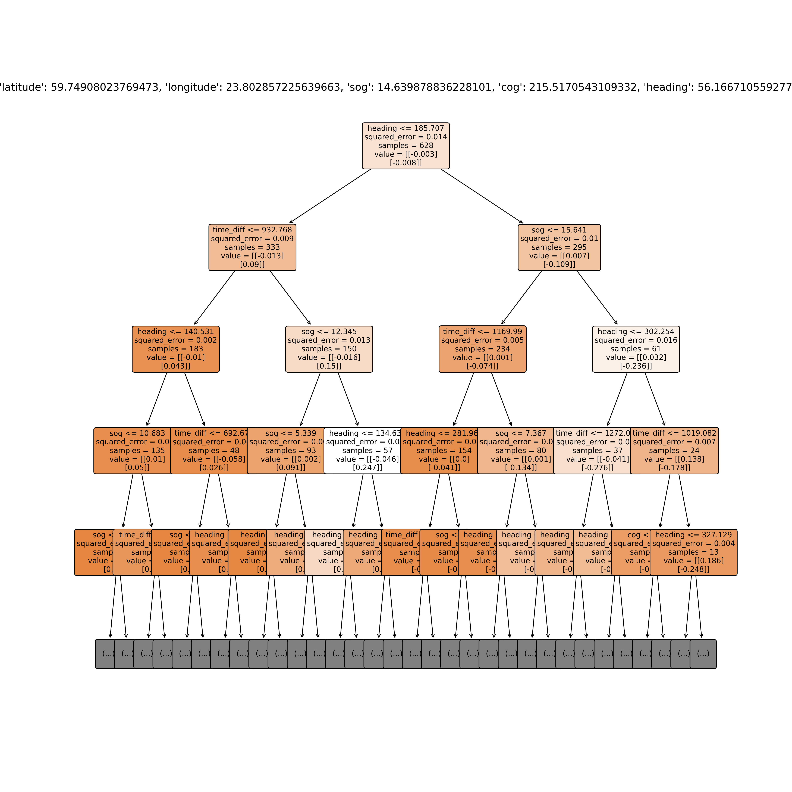

# Random Forest Model Visualization for Vessel Prediction

This document provides visualizations of the Random Forest model used in NAVICAST for vessel position prediction. The model is designed to predict vessel positions 30 minutes into the future based on current position, speed, course, and heading data.

## Model Architecture

The prediction model is a Random Forest Regressor consisting of 100 decision trees working in ensemble to predict the change in latitude and longitude of vessels. The model achieves high accuracy with a mean distance error of only 154 meters and a median error of just 11 meters for 30-minute predictions.

## Feature Importance

The following features are used by the model, ranked by their importance:

- **Speed Over Ground (SOG)**: The vessel's speed in knots
- **Heading**: The true heading of the vessel in degrees
- **Course Over Ground (COG)**: The actual direction of travel in degrees
- **Time Difference**: Prediction time window (30 minutes ahead)
- **Latitude**: Current latitude position
- **Longitude**: Current longitude position

The chart below shows the relative importance of each feature in making predictions:

## Sample Decision Tree

Each tree in the Random Forest makes decisions based on the input features to predict position changes. Below is a visualization of one sample tree from the forest:

## Multiple Decision Trees

The Random Forest consists of many different trees, each trained on a slightly different subset of the data. Here are four different trees from the ensemble to illustrate variation in the model:

## Decision Path Example

The following visualization demonstrates how a single vessel's data traverses through a decision tree to produce a prediction:

## Model Performance

As noted in the project documentation, the Random Forest model significantly outperforms simpler prediction methods:

| Model                  | Mean Distance Error (km) | Median Distance Error (km) |
|------------------------|--------------------------|----------------------------|
| Linear Regression      | 3.4280                   | 2.8059                     |
| Polynomial Regression  | 1.8130                   | 1.1577                     |
| Random Forest          | 0.1544                   | 0.0106                     |
| XGBoost                | 0.8525                   | 0.5726                     |

## Fallback Mechanism

When the machine learning model is unavailable, the system uses a fallback dead reckoning method which calculates predicted positions based on basic navigation formulas using speed, course, and heading. 