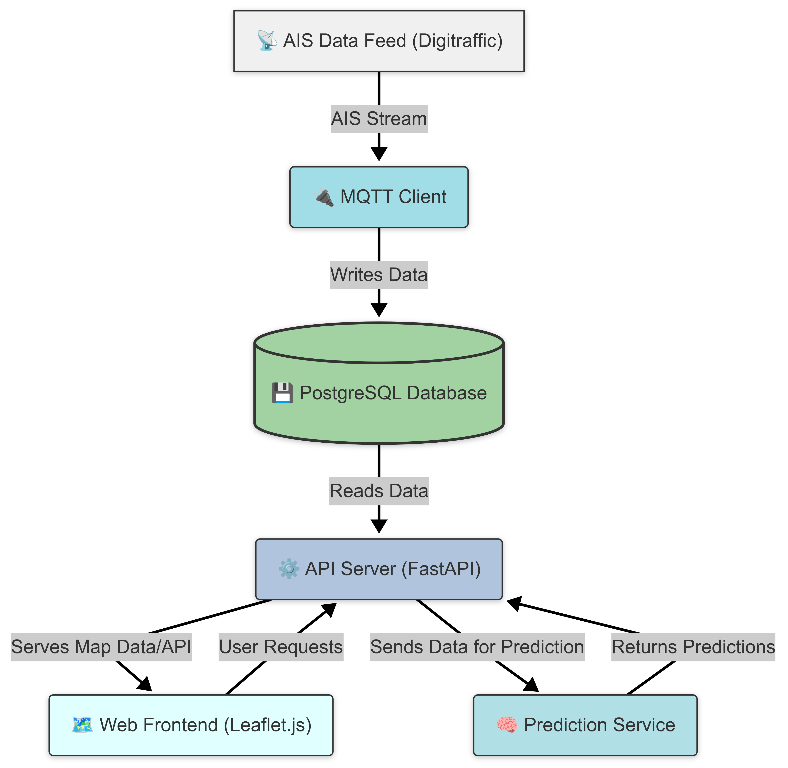

# NAVICAST Data Architecture

This document describes the data architecture of the NAVICAST system, detailing how data flows through the system from collection to visualization.

## Overview Diagram

## Components and Data Flow

### 1. Data Collection

**AIS Data Feed (Digitraffic)**
- Source of real-time vessel position and information data
- Provides AIS messages via MQTT protocol
- Data includes vessel identification, position, speed, course, etc.
- Messages follow standard AIS format with Digitraffic-specific extensions

**MQTT Client**
- Subscribes to Digitraffic AIS topics
- Processes incoming AIS messages
- Validates and transforms data
- Batches messages for efficient database insertion
- Handles network issues and connection recovery

**Data Flow**:
1. Digitraffic publishes AIS messages to MQTT topics
2. MQTT client subscribes to relevant topics
3. Client receives messages, validates them, and prepares for storage
4. Validated data is inserted into the PostgreSQL database

### 2. Data Storage

**PostgreSQL Database**
- Relational database storing all vessel and prediction data
- Primary tables:
  - `raw_ais_data`: Current and historical vessel information
  - `predictions`: Vessel trajectory predictions

**Schema Details**:

`raw_ais_data` table:
- `vessel_id` (INTEGER): MMSI number of the vessel
- `latitude` (DOUBLE PRECISION): Current latitude
- `longitude` (DOUBLE PRECISION): Current longitude
- `timestamp` (TIMESTAMP): Time when data was recorded
- `raw_json` (JSONB): Original AIS message in JSON format with the following properties:
  - `sog` (DOUBLE PRECISION): Speed over ground in knots
  - `cog` (DOUBLE PRECISION): Course over ground in degrees
  - `heading` (INTEGER): Heading in degrees
  - `nav_stat` (INTEGER): Navigation status code
  - `pos_acc` (BOOLEAN): Position accuracy indicator

`predictions` table:
- `id` (SERIAL, PRIMARY KEY): Unique identifier
- `vessel_id` (INTEGER): References raw_ais_data(vessel_id)
- `predicted_latitude` (DOUBLE PRECISION): Predicted latitude
- `predicted_longitude` (DOUBLE PRECISION): Predicted longitude
- `prediction_for_timestamp` (TIMESTAMP): Time for which prediction is made
- `prediction_made_at` (TIMESTAMP): Time when prediction was calculated

### 3. Data Processing

**Prediction Service**
- Periodically processes latest vessel data
- Analyzes vessel speed, course, and heading
- Calculates predicted positions using machine learning model
- Provides fallback to dead reckoning when appropriate
- Stores prediction results in database
- Performs data validation and sanity checks

**Processing Steps**:
1. Retrieve recent vessel data from database (last 30 minutes)
2. Filter vessels appropriate for prediction (e.g., moving vessels with speed > 0.5 knots)
3. For each vessel:
   - Apply prediction algorithm (ML model with fallback to dead reckoning)
   - Validate prediction results (ensure predictions are within reasonable limits)
   - Store valid predictions in database
4. Remove outdated predictions

### 4. Data Access and API

**API Server**
- Provides REST API endpoints for data access
- Retrieves vessel and prediction data from database
- Formats responses as JSON
- Allows filtering data by vessel ID and time range
- Provides data download capabilities in multiple formats

**Key Endpoints**:
- `GET /vessels`: Retrieves vessel data with optional filtering
- `GET /vessels/{vessel_id}`: Gets detailed information about a specific vessel
- `GET /vessels/download`: Downloads vessel data in JSON or CSV format
- `GET /health`: API health check endpoint

**Data Enrichment**:
- The API enhances raw data with:
  - Country information derived from MMSI
  - Human-readable vessel type names
  - Navigation status descriptions

### 5. Data Visualization

**Web Frontend**
- Displays vessels on interactive map using Leaflet.js
- Shows vessel information in popup panels
- Visualizes predicted trajectories with dotted lines
- Updates in real-time (10-second refresh interval)
- Provides user controls for display options (theme switching, prediction toggling)

**Visualization Flow**:
1. Frontend requests data from API server
2. API server retrieves and returns formatted data
3. Frontend renders vessels on map with appropriate styling
4. Frontend updates vessel positions and predictions periodically
5. User interactions trigger additional data requests or UI updates

## Data Retention and Management

- **Raw AIS Data**: Stored for 24 hours by default (configurable)
- **Predictions**: Stored until superseded by newer predictions
- **Data Cleanup**: Automated process removes old data
- **Backup**: Regular database backups recommended

## Data Security Considerations

- No personal information is stored in the system
- AIS data is publicly available maritime information
- Database access is restricted via username/password authentication
- API does not require authentication in current implementation (intended for private deployments)

## Data Monitoring

- System logs track data processing and errors
- API requests are logged for monitoring
- Database performance should be monitored
- Prediction quality can be evaluated by comparing predictions to actual positions 